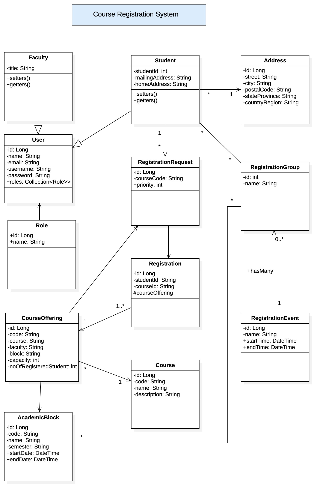

## Course Registration System

RESTful web services to automate the process of course registration for students. Each student should be able to create registration requests for the future blocks during the registration period. Faculty should be able to “view” the registrations for any student. Admins should be able to add new courses and offerings and edit any enrollment record.

**Use Cases**
1. Students should be able to GET /registration-events/latest and receive the most recent RegistrationEvent. By looking at the start and end datetime, you should be able to tell if registration is open, closed or in progress.
2. RegistrationEvent is a complex object that consists of multiple RegistrationGroups and each group consists of a list of students and a list of blocks. Each block has a list of course offerings.
3. SysAmin should be able to perform CRUD operations on RegistrationEvent. You can break RegistrationEvent down to pieces and let the user create/update these parts piece by piece.
4. When students read RegistrationEvent, system filters the list of registration groups to the one that student is a member of. Furthermore, the list of students will be masked for student view. So, students see RegistrationEvent -> RegistrationGroups -> AcademicBlocks -> CourseOfferings
5. Students can submit a list of RegistrationRequest objects. There should be one object per course offering for all blocks available to select from (you should validate that). The system will allow the student to save the list during an active RegistrationEvent (between the start and end date & time).
6. Students should be able to see a list of Registraions. GET /registrations
7. SysAdmin should be able to “process” a registration event by calling:

    PATCH /registration-events/{id}?processed=true

**Package**
miu.edu.ea.courseregistration

**Folder Structure**

|—— Controller

|—— Model

|————Enums

|——Repository

|——Service

|——Config

